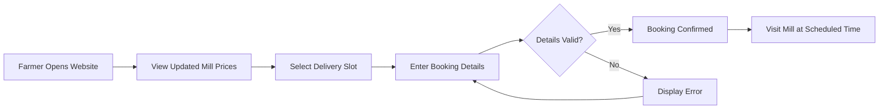
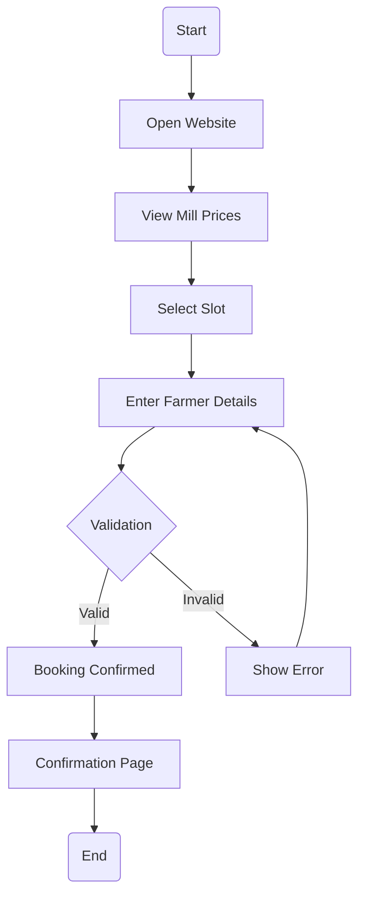
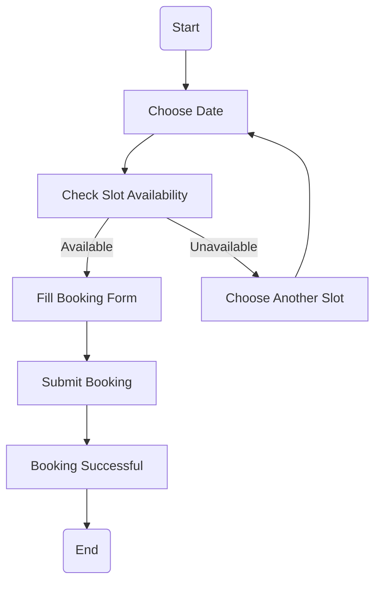
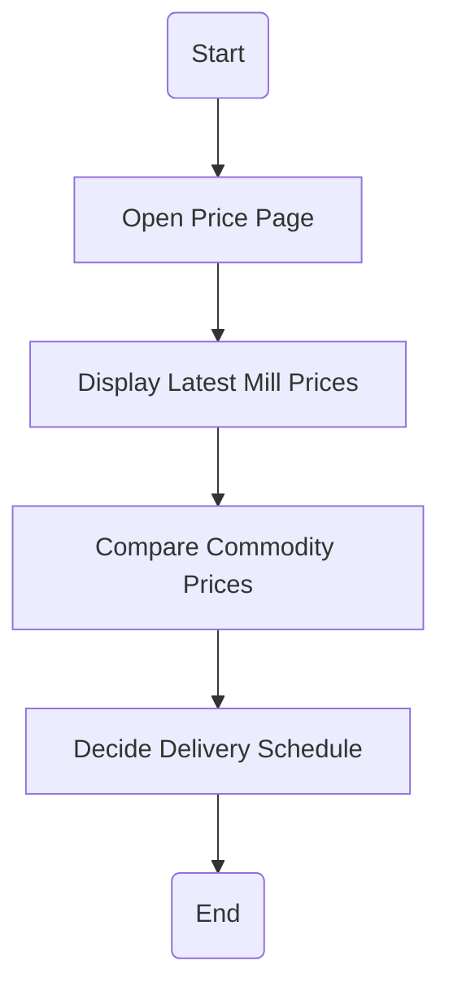
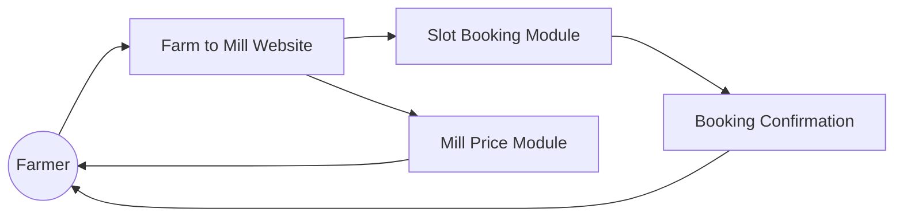

# 🌾 Farm to Mill Logistics

A web-based platform designed to simplify the transportation of agricultural produce from farmers to mills. The application allows farmers to **book delivery slots online**, **avoid long waiting queues**, and **view updated mill prices** before planning their deliveries.

---

## 📖 Table of Contents

- [About the Project](#-about-the-project)
- [Problem Statement](#-problem-statement)
- [Solution](#-solution)
- [Features](#-features)
- [Technology Stack](#-technology-stack)
- [Project Structure](#-project-structure)
- [Workflow](#-workflow)
- [Flowcharts](#-flowcharts)
- [Installation](#-installation)
- [Future Enhancements](#-future-enhancements)
- [Contributors](#-contributors)
- [License](#-license)

---

## 📌 About the Project

Farm to Mill Logistics is a frontend web application that helps farmers schedule deliveries to mills through an online slot booking system. It minimizes waiting time, improves scheduling efficiency, and provides updated mill prices to help farmers make informed decisions.

---

## ❗ Problem Statement

Farmers often experience:

- Long waiting queues at mills.
- Uncertainty about mill prices.
- Poor scheduling of deliveries.
- Loss of valuable time and fuel.

---

## 💡 Solution

The Farm to Mill Logistics platform provides:

- Online slot booking.
- Updated mill price information.
- Easy-to-use interface.
- Faster and more organized delivery scheduling.

---

## ✨ Features

- 🚜 Online Slot Booking
- 📈 Updated Mill Prices
- ⏰ Queue Reduction
- 📱 Responsive Design
- ⚡ User-Friendly Interface
- 📝 Booking Confirmation

---

## 💻 Technology Stack

| Technology | Purpose |
|------------|---------|
| HTML5 | Webpage Structure |
| CSS3 | Styling & Responsive Design |
| JavaScript | Dynamic Functionality |

---

## 📂 Project Structure

```text
Farm-to-Mill-Logistics/
│
├── index.html
├── booking.html
├── prices.html
├── about.html
├── contact.html
│
├── css/
│   └── style.css
│
├── js/
│   └── script.js
│
├── images/
│
└── README.md
```

---

# 🔄 Workflow



---

# 📊 Flowcharts

## 1️⃣ Overall System Flow



---

## 2️⃣ Slot Booking Process



---

## 3️⃣ Mill Price Information



---

## 🏗️ System Architecture



---

## 🚀 Installation

1. Clone the repository

```bash
git clone https://github.com/your-username/Farm-to-Mill-Logistics.git
```

2. Open the project folder.

3. Open `index.html` in your browser.

No additional installation is required.

---

## 🎯 Future Enhancements

- User Authentication
- Admin Dashboard
- Real-time Database Integration
- Online Payment Gateway
- SMS & Email Notifications
- GPS Tracking
- Multi-language Support
- Weather Forecast Integration
- Mobile Application

---

## 👨‍💻 Contributors

- Ashok C
- Team Members

---

## 📄 License

This project is developed for educational purposes.# 🌾 Farm to Mill Logistics

A web-based platform designed to simplify the transportation of agricultural produce from farmers to mills. The application allows farmers to **book delivery slots online**, **avoid long waiting queues**, and **view updated mill prices** before planning their deliveries.

---

## 📖 Table of Contents

- [About the Project](#-about-the-project)
- [Problem Statement](#-problem-statement)
- [Solution](#-solution)
- [Features](#-features)
- [Technology Stack](#-technology-stack)
- [Project Structure](#-project-structure)
- [Workflow](#-workflow)
- [Flowcharts](#-flowcharts)
- [Installation](#-installation)
- [Future Enhancements](#-future-enhancements)
- [Contributors](#-contributors)
- [License](#-license)

---

## 📌 About the Project

Farm to Mill Logistics is a frontend web application that helps farmers schedule deliveries to mills through an online slot booking system. It minimizes waiting time, improves scheduling efficiency, and provides updated mill prices to help farmers make informed decisions.

---

## ❗ Problem Statement

Farmers often experience:

- Long waiting queues at mills.
- Uncertainty about mill prices.
- Poor scheduling of deliveries.
- Loss of valuable time and fuel.

---

## 💡 Solution

The Farm to Mill Logistics platform provides:

- Online slot booking.
- Updated mill price information.
- Easy-to-use interface.
- Faster and more organized delivery scheduling.

---

## ✨ Features

- 🚜 Online Slot Booking
- 📈 Updated Mill Prices
- ⏰ Queue Reduction
- 📱 Responsive Design
- ⚡ User-Friendly Interface
- 📝 Booking Confirmation

---

## 💻 Technology Stack

| Technology | Purpose |
|------------|---------|
| HTML5 | Webpage Structure |
| CSS3 | Styling & Responsive Design |
| JavaScript | Dynamic Functionality |

---

## 📂 Project Structure

```text
Farm-to-Mill-Logistics/
│
├── index.html
├── booking.html
├── prices.html
├── about.html
├── contact.html
│
├── css/
│   └── style.css
│
├── js/
│   └── script.js
│
├── images/
│
└── README.md
```

---

# 🔄 Workflow


---

# 📊 Flowcharts

## 1️⃣ Overall System Flow


---

## 2️⃣ Slot Booking Process


---

## 3️⃣ Mill Price Information


---

## 🏗️ System Architecture


---

## 🚀 Installation

1. Clone the repository

```bash
git clone https://github.com/your-username/Farm-to-Mill-Logistics.git
```

2. Open the project folder.

3. Open `index.html` in your browser.

No additional installation is required.

---

## 🎯 Future Enhancements

- User Authentication
- Admin Dashboard
- Real-time Database Integration
- Online Payment Gateway
- SMS & Email Notifications
- GPS Tracking
- Multi-language Support
- Weather Forecast Integration
- Mobile Application

---

## 👨‍💻 Contributors

- Ashok C
- Team Members

---

## 📄 License

This project is developed for educational purposes.
